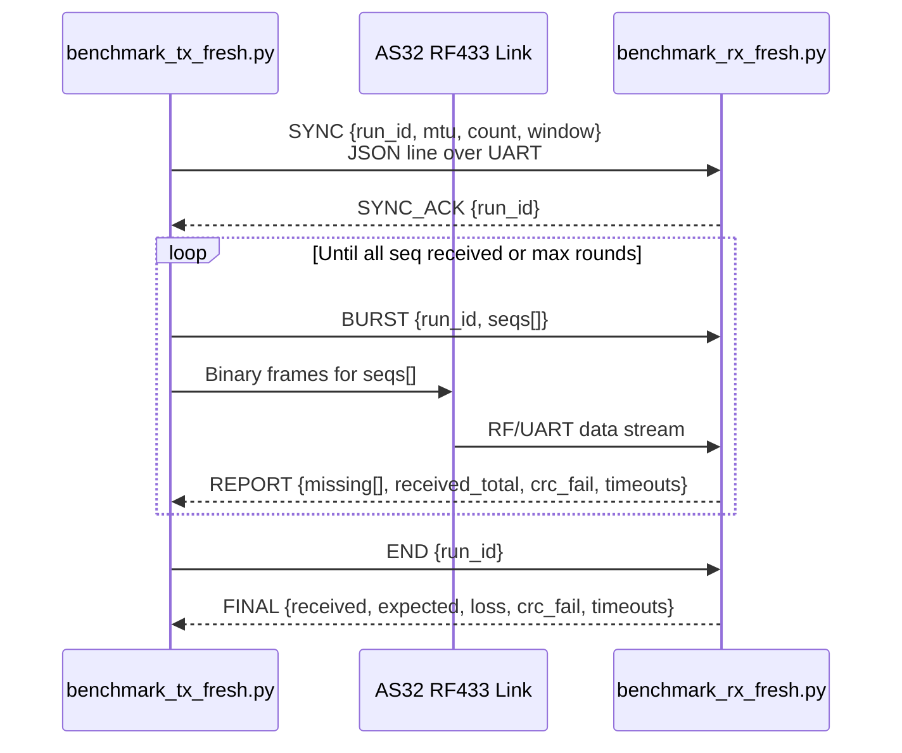

# RF433 Throughput Benchmark (AS32 @ 9600 baud)

A practical benchmark suite for finding the best MTU + air-gap settings on AS32 RF433 modules.

This README documents the **fresh benchmark flow**:
- `benchmark_tx_fresh.py`
- `benchmark_rx_fresh.py`
- `analyze_fresh.py`

---

## What This Measures

For each `(MTU, gap_ms)` point, the benchmark records:
- RF throughput (`rf_throughput`, B/s)
- Packet completion (`packets_received/packets_expected`)
- Loss (%)
- CRC failure rate (%)
- Timeout count
- Whether the run aborted

This helps you compare **speed vs robustness** and pick the true operating point.

---

## Transmission Diagram



  ### Protocol Type

  This is **not** stop-and-wait ARQ.

  It is closer to a **windowed selective-repeat ARQ (block-based)**:
  - TX sends a burst (`seqs[]`) within a window.
  - RX reports only missing sequence numbers for that burst.
  - TX retransmits only missing frames in later rounds.

  So practically: **windowed burst + selective retransmission via missing-list reports**.

### Data Frame Format (binary)

Each frame has fixed size = `MTU` bytes:

```text
+--------+--------+--------+--------+------------+-----------------+---------+
| MAGIC  | run_id |  seq   | total  | payload_len| payload bytes   | CRC32   |
| 2B     | 2B     | 2B     | 2B     | 2B         | (MTU - 14) bytes| 4B      |
+--------+--------+--------+--------+------------+-----------------+---------+
```

- `MAGIC = 0xA55A`
- CRC32 is computed over header + payload (everything except final 4 bytes).

---

## Why Re-requests Happen More on Large MTU

- Larger frames contain more bits, so one bit error is more likely to corrupt the whole frame.
- One corruption triggers CRC fail → RX reports missing sequence(s) → TX resends.
- Even with more retries, large MTU can still win throughput because payload efficiency is much higher (`payload = MTU - 14`).

---

## Fresh Benchmark Design

This project uses a **two-plane protocol** for RF433 benchmarking:

1. **Control plane (JSON line messages over UART)**
   - `SYNC` → start test session with `run_id`, `mtu`, `count`, `window`
   - `BURST` → announce which sequence numbers are sent in this round
   - `REPORT` → receiver returns missing sequence numbers, crc/timeouts counters
   - `END` / `FINAL` → close and summarize run

2. **Data plane (fixed-size binary RF frames)**
   - Fixed frame size equals selected `MTU`
   - Header contains `MAGIC`, `run_id`, `seq`, `total`, `payload_len`
   - CRC32 protects header + payload

### Reliability model

- Sender transmits a **windowed burst** of sequence numbers.
- Receiver validates each frame and accumulates missing frames.
- Receiver sends a single `REPORT` per burst (missing list + error counters).
- Sender retransmits only missing frames in later rounds.

This is a **block-based selective-repeat ARQ** (sliding-window-like), optimized for low-rate noisy links.

---

## Difference from `how` Code

The `how` folder demonstrates a simpler ACK/ASK file-transfer loop. The fresh benchmark design is intentionally different:

- **Protocol style**
  - `how`: mostly packet-by-packet ACK/ASK rollback (`ACKn`, `ASKn`)
  - fresh benchmark: burst + missing-list report (block selective repeat)

- **Control messaging**
  - `how`: control is embedded in text payload inside packet frames
  - fresh benchmark: explicit JSON control messages (`SYNC`, `BURST`, `REPORT`, `END`, `FINAL`)

- **Session safety**
  - `how`: no strong run/session isolation
  - fresh benchmark: each run has `run_id` to prevent cross-run contamination

- **Benchmark quality**
  - `how`: focused on file transfer behavior and ACK loop
  - fresh benchmark: focused on repeatable MTU/gap optimization with machine-readable metrics

- **Observability**
  - `how`: basic transfer progress logs
  - fresh benchmark: structured telemetry (missing, crc_fail, timeouts, aborted)

Both approaches are valid, but this repository’s **optimization workflow** should use the fresh benchmark scripts.

---

## Quick Start

### 1) Start receiver first

```bash
python benchmark_rx_fresh.py
```

### 2) Run transmitter sweep

```bash
python benchmark_tx_fresh.py
```

### 3) Analyze top configurations

```bash
python analyze_fresh.py
```

---

## Recommended Test Settings (for final decision)

For presentation-quality confidence (not just quick smoke tests):
- `PACKETS_PER_TEST = 200` (or 300)
- `REPEATS = 5`
- Keep same antenna placement, power source, and distance for all runs

This reduces “lucky run” bias.

---

## Output File

`rf433_results_fresh.json` structure:

```json
{
  "256": [
    {
      "gap_ms": 5,
      "repeat": 1,
      "rf_throughput": 775.9,
      "expected_throughput": 890.8,
      "loss": 0.0,
      "packets_received": 10,
      "packets_expected": 10,
      "crc_failure_percent": 0.0,
      "timeouts": 0,
      "aborted": false
    }
  ]
}
```

---

## How to Pick the Optimal Point

Use both speed and stability:
- Prefer high throughput
- Penalize CRC/timeouts
- Reject unstable points (example: CRC > 1% or timeouts > 0)

`analyze_fresh.py` already ranks by goodput and prints the recommended point.

---

## Dependencies

```bash
pip install pyserial
```

(Use matplotlib only if you add plotting scripts.)

---

## Hardware Map

```text
[PC] --UART COM4--> [AS32 TX]  ~~~RF~~~  [AS32 RX] --UART COM5--> [PC]
```

- UART baudrate: `9600`
- Keep antennas and power stable during full sweep.

---

## Notes

- Legacy scripts (`Transmitter.py`, `Receiver.py`, `Plotter.py`, `Overview.py`) are older workflow.
- For optimization on AS32, use the **fresh benchmark scripts** documented here.

---

## Python Library Usage (`rf433lib`)

You can now import a reusable RF433 over-the-air communication library in other projects.

### Modules

- `rf433lib.protocol` → low-level frame + control helpers
- `rf433lib.receiver.RF433Receiver` → receiver class (receive one payload/session)
- `rf433lib.transmitter.RF433Transmitter` → transmitter class (send payload reliably)

### Quick example

```python
from rf433lib import RF433Receiver, RF433Transmitter
from rf433lib.receiver import ReceiverConfig
from rf433lib.transmitter import TransmitterConfig

# Receiver side (one message/session)
receiver = RF433Receiver(ReceiverConfig(port="COM5", baudrate=9600))
result = receiver.receive_once()

# Transmitter side
tx = RF433Transmitter(TransmitterConfig(port="COM4", baudrate=9600))
result = tx.send_bytes(b"hello", mtu=256, gap_ms=3, metadata={"topic": "demo"})
print(result)
```

See `rf433lib_example.py` for a runnable example.
