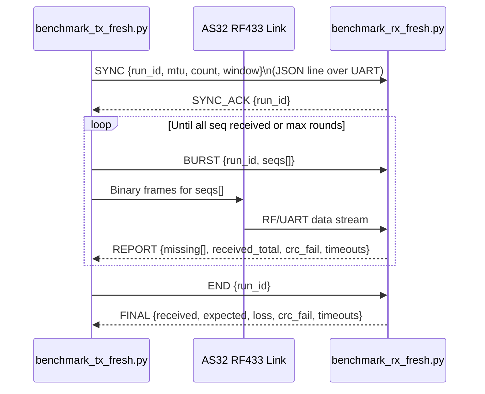

# RF433 Throughput Benchmark (AS32 @ 9600 baud)

A practical benchmark suite for finding the best MTU + air-gap settings on AS32 RF433 modules.

This README documents the **fresh benchmark flow**:
- `benchmark_tx_fresh.py`
- `benchmark_rx_fresh.py`
- `analyze_fresh.py`

---

## What This Measures

For each `(MTU, gap_ms)` point, the benchmark records:
- RF throughput (`rf_throughput`, B/s)
- Packet completion (`packets_received/packets_expected`)
- Loss (%)
- CRC failure rate (%)
- Timeout count
- Whether the run aborted

This helps you compare **speed vs robustness** and pick the true operating point.

---

## Transmission Diagram



### Data Frame Format (binary)

Each frame has fixed size = `MTU` bytes:

```text
+--------+--------+--------+--------+------------+-----------------+---------+
| MAGIC  | run_id |  seq   | total  | payload_len| payload bytes   | CRC32   |
| 2B     | 2B     | 2B     | 2B     | 2B         | (MTU - 14) bytes| 4B      |
+--------+--------+--------+--------+------------+-----------------+---------+
```

- `MAGIC = 0xA55A`
- CRC32 is computed over header + payload (everything except final 4 bytes).

---

## Why Re-requests Happen More on Large MTU

- Larger frames contain more bits, so one bit error is more likely to corrupt the whole frame.
- One corruption triggers CRC fail → RX reports missing sequence(s) → TX resends.
- Even with more retries, large MTU can still win throughput because payload efficiency is much higher (`payload = MTU - 14`).

---

## Quick Start

### 1) Start receiver first

```bash
python benchmark_rx_fresh.py
```

### 2) Run transmitter sweep

```bash
python benchmark_tx_fresh.py
```

### 3) Analyze top configurations

```bash
python analyze_fresh.py
```

---

## Recommended Test Settings (for final decision)

For presentation-quality confidence (not just quick smoke tests):
- `PACKETS_PER_TEST = 200` (or 300)
- `REPEATS = 5`
- Keep same antenna placement, power source, and distance for all runs

This reduces “lucky run” bias.

---

## Output File

`rf433_results_fresh.json` structure:

```json
{
  "256": [
    {
      "gap_ms": 5,
      "repeat": 1,
      "rf_throughput": 775.9,
      "expected_throughput": 890.8,
      "loss": 0.0,
      "packets_received": 10,
      "packets_expected": 10,
      "crc_failure_percent": 0.0,
      "timeouts": 0,
      "aborted": false
    }
  ]
}
```

---

## How to Pick the Optimal Point

Use both speed and stability:
- Prefer high throughput
- Penalize CRC/timeouts
- Reject unstable points (example: CRC > 1% or timeouts > 0)

`analyze_fresh.py` already ranks by goodput and prints the recommended point.

---

## Dependencies

```bash
pip install pyserial
```

(Use matplotlib only if you add plotting scripts.)

---

## Hardware Map

```text
[PC] --UART COM4--> [AS32 TX]  ~~~RF~~~  [AS32 RX] --UART COM5--> [PC]
```

- UART baudrate: `9600`
- Keep antennas and power stable during full sweep.

---

## Notes

- Legacy scripts (`Transmitter.py`, `Receiver.py`, `Plotter.py`, `Overview.py`) are older workflow.
- For optimization on AS32, use the **fresh benchmark scripts** documented here.
