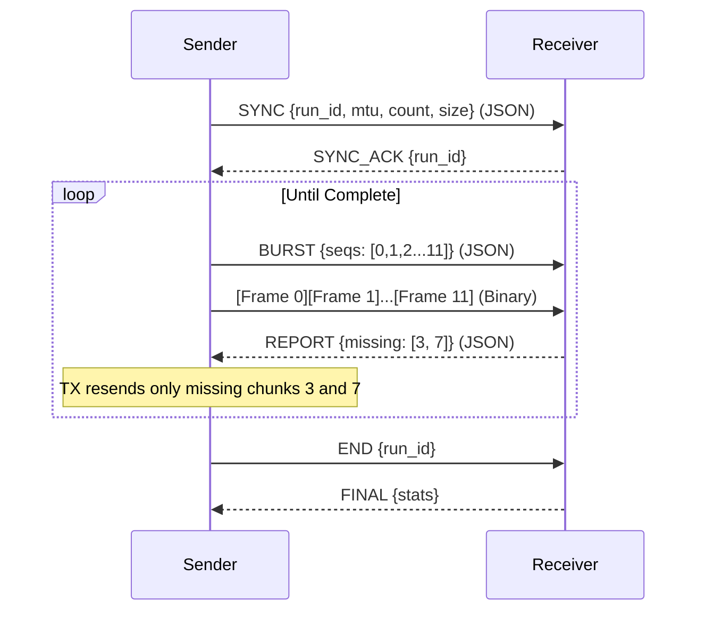

# RF433 File Transfer & Benchmark Suite (AS32 @ 9600 baud)

A robust, windowed ARQ file transfer implementation for low-bandwidth RF433 modules (like AS32 / HC-12), including tools for benchmarking optimal MTU and gap settings.

## Quick Start: File Transfer

Use these tools to send files reliably between two computers over RF433.

### 1. Start Receiver
Run this on the receiving computer. It will listen indefinitely.
```bash
python receive_file.py --out-dir received_files --port COM5
```

### 2. Send File
Run this on the transmitting computer.
```bash
python send_file.py my_file.zip --port COM4
```
**Key Options:**
- `--mtu 256`: Set packet size (default 256). Larger is faster but more prone to interference.
- `--gap 0`: Delay between packets in ms. Increase if receiver is overwhelmed.

---

## How it Works (`rf433lib`)

The core logic (in `rf433lib/`) implements a **windowed selective-repeat ARQ** protocol. It is designed to be much more efficient than simple stop-and-wait approaches.

### Protocol Flow


```mermaid
sequenceDiagram
    participant TX as Sender
    participant RX as Receiver

    TX->>RX: SYNC {run_id, mtu, count, size} (JSON)
    RX-->>TX: SYNC_ACK {run_id}

    loop Until Complete
        TX->>RX: BURST {seqs: [0,1,2...11]} (JSON)
        TX->>RX: [Frame 0][Frame 1]...[Frame 11] (Binary)
        RX-->>TX: REPORT {missing: [3, 7]} (JSON)
        Note over TX: TX resends only missing chunks 3 and 7
    end

    TX->>RX: END {run_id}
    RX-->>TX: FINAL {stats}
```

### Key Concepts

1.  **Split Control & Data Plane**:
    *   **Control (JSON)**: `SYNC`, `BURST`, `REPORT`, `END` messages are sent as clear text JSON lines. This ensures reliable state management.
    *   **Data (Binary)**: Actual file chunks are sent as fixed-size binary frames with a custom header and CRC32 checksum.

2.  **Selective Retransmission**:
    *   The sender transmits a "window" of packets (e.g., 12 packets).
    *   The receiver tracks which sequence numbers arrived successfully.
    *   The receiver sends a *single* report listing only the missing sequence numbers.
    *   The sender re-queues only those missing packets for the next burst.

3.  **Data Integrity**:
    *   Every packet has a 32-bit CRC. Corrupt packets are silently discarded.
    *   The file is re-assembled only from valid chunks.
    *   An optional SHA1 hash of the full file is verified at the end.

### Low-Level Frame Detail

The protocol uses a fixed-size frame structure to simplify handling on the receiver side.
Every frame is exactly `MTU` bytes long.

```text
 0      2      4      6      8      10                   MTU-4   MTU
 +------+------+------+------+------+----------------------+------+
 | MAGIC|Run ID| Seq  |Total | Len  | Payload Data (Padded)| CRC32|
 +------+------+------+------+------+----------------------+------+
 |  2B  |  2B  |  2B  |  2B  |  2B  |    (MTU - 14) bytes  |  4B  |
 +------+------+------+------+------+----------------------+------+
```

**Fields:**
*   **MAGIC** (`0xA55A`): Sync marker to identify valid frames in the stream.
*   **Run ID**: Random 16-bit ID to associate frames with a specific session (prevents mixing old/new transfers).
*   **Seq**: Sequence number of this chunk (0-indexed).
*   **Total**: Total number of chunks in this session.
*   **Len**: Actual length of valid data in the payload section (if less than capacity).
*   **Payload**: The file data. If actual data < capacity, it is padded with null bytes.
*   **CRC32**: Checksum of the entire frame (Header + Payload) to detect bit flips.

---

## Detailed Arguments

### `send_file.py`

| Argument | Default | Description |
| :--- | :--- | :--- |
| `file` | (Required) | Path to the file you want to send. |
| `--port` | `COM4` | The serial port where your transmitter module is connected. |
| `--baud` | `9600` | Baud rate for the serial connection. Must match the module settings. |
| `--mtu` | `256` | Maximum Transmission Unit (packet size) in bytes. Includes 14-byte header. |
| `--gap` | `0` | Delay in milliseconds between sending each packet in a burst. Increase if the receiver drops too many packets. |
| `--window` | `12` | Number of packets sent in one burst before waiting for a report from the receiver. |
| `--max-rounds` | `100` | Maximum number of retransmission rounds before aborting. |

### `receive_file.py`

| Argument | Default | Description |
| :--- | :--- | :--- |
| `--out-dir` | `received_files` | Directory where received files will be saved. |
| `--port` | `COM5` | The serial port where your receiver module is connected. |
| `--baud` | `9600` | Baud rate for the serial connection. |

---

## Limitations

*   **Maximum File Size**: The protocol uses a 16-bit sequence number.
    *   Max Chunks: 65,535
    *   Max File Size = `65535 * (MTU - 14)` bytes
    *   *Example*: With MTU=256, max file size is approx **15.8 MB**.
*   **Minimum MTU**: The MTU must be at least **15 bytes** (14 bytes overhead + 1 byte payload).
    *   *Warning*: Setting `--mtu` to 14 or lower will cause the transmitter script to exit immediately with a `ValueError`.
*   **Half-Duplex**: The protocol assumes a half-duplex link (cannot send and receive simultaneously). The stop-and-wait windowed approach is designed specifically for this constraint.
*   **Timeouts**: Transfer will abort if the receiver does not respond to a SYNC or BURST within the timeout period (default ~5s).
*   **Memory**: The current implementation loads the entire file into RAM before sending/saving.

---

## Benchmark Tools

If you want to find the optimal settings (MTU and Gap) for your specific hardware/distance, use the benchmark suite.

1.  **Start Benchmark Receiver**:
    ```bash
    python benchmark_rx_fresh.py
    ```

2.  **Run Benchmark Sweep**:
    ```bash
    python benchmark_tx_fresh.py
    ```
    *(Edit the script to configure the list of MTUs and Gaps to test)*

3.  **Analyze Results**:
    ```bash
    python analyze_fresh.py
    ```
    This will calculate the effective throughput for each setting and recommend the best configuration.

---

## Hardware Setup

```text
[PC A] --UART(COM4)--> [AS32 TX]  ~~~ 433 MHz ~~~  [AS32 RX] --UART(COM5)--> [PC B]
```

- **Module**: AS32 (LoRa) or HC-12
- **Baud Rate**: 9600 (Recommended for stability)
- **Power**: Ensure stable 3.3V-5V power supply. RF modules are sensitive to voltage drops during transmission.

## Library Structure

You can use `rf433lib` in your own python scripts:

- `rf433lib.transmitter`: `RF433Transmitter` class for sending data.
- `rf433lib.receiver`: `RF433Receiver` class for receiving data.
- `rf433lib.protocol`: Internal frame packing/unpacking and protocol definitions.

**Example Usage:**

```python
from rf433lib.transmitter import RF433Transmitter

tx = RF433Transmitter()
tx.send_bytes(b"Hello World", mtu=128)
```
